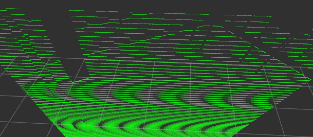

# ariac_gazebo_lidar
ARIAC simulation setup with TB3 as a testbench for PCL modules with LiDAR and Intel Realsense d435 Depth Camera

## Current Modules:

### Simulation
The simulation environment of TurtleBot3 in Gazebo using the ARIAC factory floor world can be used via the ```ariac_tb3``` package. To spawn tb3 in ariac standalone:
```bash
roslaunch ariac_tb3 turtlebot_ariac.launch
```
I have written URDF xacros for the TurtleBot BURGER model, not WAFFLE_PI. 
Ensure that the TURTLEBOT3 model is set to BURGER.

To launch TB3(Burger) with the Intel Realsense D435 depth camera mounted on it,
```bash
export TURTLEBOT3_MODEL=burger;roslaunch ariac_tb3 turtlebot3_D435_ariac.launch
```
### Realsense D435 camera plugins
Two packages ```realsense_gazebo_plugin``` and ```realsense2_description``` are used for the D435 camera plugin.
To setup individually, 
```bash
sudo apt-get install ros-$ROS_DISTRO-realsense2-camera
sudo apt-get install ros-$ROS_DISTRO-realsense2-description
```
To run a unit test on whether the camera is working fine standalone, source your workspace and then,
```bash
roslaunch realsense2_description view_d435_model_rviz_gazebo.launch
```
### Ground Plane Segmentation
The package ```groundplane_segmentation``` is used to segment the ground plane from the point cloud obtained from the D435 depth camera on the TurtleBot3.
Configure the parameters in  ```groundplane_segmentation/config/params.yaml```:

ROS Topics:
```
LIDAR_TOPIC_SUBSCRIBE: Topic to subscribe the Point Cloud from.

SEG_PUB: Topic on which to publish the segmented Point Cloud.
```
Modes:
To publish the point cloud without the ground, toggle the param ```bool_display_groundplane``` in ```params.yaml```
Set false to remove the inliers AKA ground points, and keep the rest of the points.

| bool_display_groundplane = true | bool_display_groundplane = false | 
| :---        |    :----:   |
|      |       |

Segmentation Parameters for tuning:
```
MAX_HEIGHT: # Max height upto which points above the ground plane are considered part of the ground plane.
```
Example:

| MAX_HEIGHT = 0.2      | MAX_HEIGHT = 0.007 | 
| :---        |    :----:   |
|      |       | 

```
FLOOR_MAX_ANGLE: # Angle between the XY plane at the cameras height and it's optical plane. 
(Angle at which the camera pitches down)
```
```
bool_filter_ground: Toggle to enable groundplane segmentation.
```
